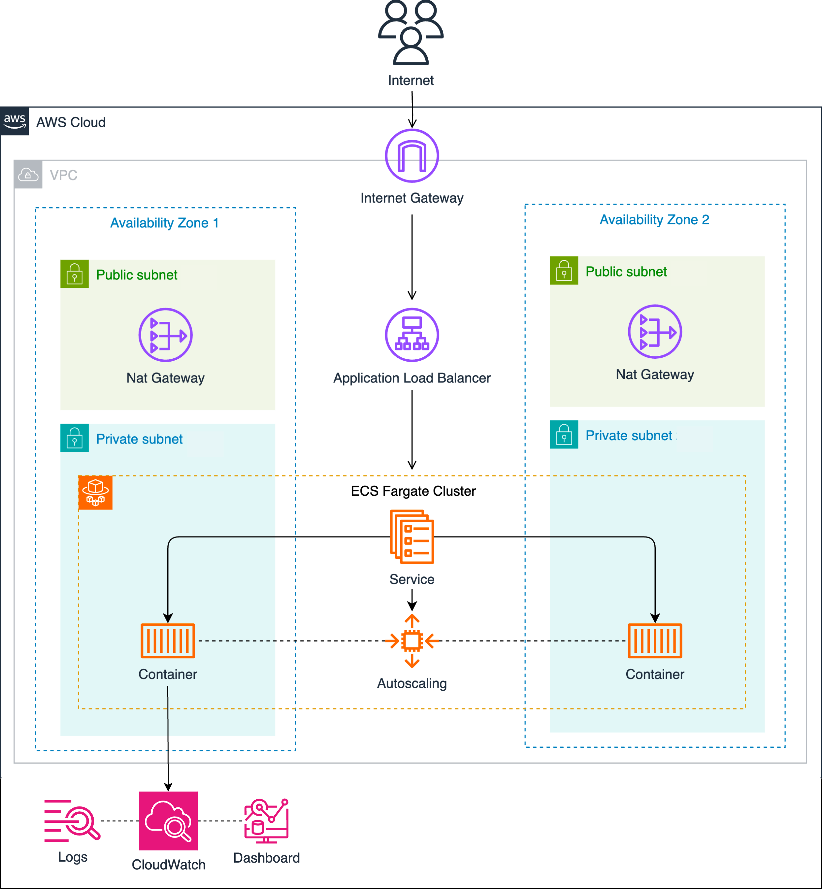
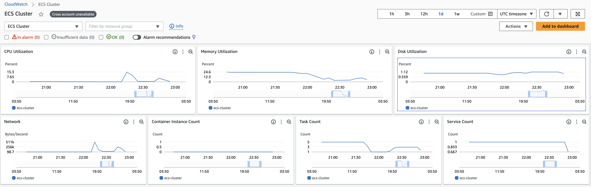

# NodeJS API on ECS Fargate using Terraform

Terraform project for provisioning a [sample NodeJS API](https://github.com/yavisht/GenratrAPI) on [AWS ECS Fargate](https://aws.amazon.com/fargate/) fronted by an Application Load balancer (ALB), using AWS best practices for networking and providing auto scaling policies based on load.

## Architecture



- Inbound traffic is routed through an ALB exposed to the internet.
- Using the ALB's, the requests are forwarded to the ECS service and tasks (containers).
- Since ECS Fargate tasks are launched in a private subnet, there's a pair of NAT Gateways to route outbound traffic out to the internet (used by ECS to pull the image from DockerHub).

## Component details

| Name | Description |
|------|-------------|
| [main.tf](./infra/main.tf) | AWS provider definition |
| [ecs.tf](./infra/ecs.tf) | Deploys the ECS Cluster, Service, Task Definition and CloudWatch Log Group  |
| [loadbalancer.tf](./infra/loadbalancer.tf) | Deploys an ALB to the public subnets, exposing the ECS services. Configures a Target Group and the healh checks|
| [autoscaling.tf](./infra/autoscaling.tf) | Creates the CloudWatch alarms and policies. It deploys two auto scaling policies to scale up and down based on CPU usage. |
| [iam.tf](./infra/iam.tf) | Creates the IAM roles for ECS task execution |
| [vpc.tf](./infra/vpc.tf) | Deploys a tiered VPC with a pair of public and private subnets spread across two AZs. It deploys an Internet gateway, with a default route on the public subnets. It deploys a pair of NAT gateways (one in each AZ), and default routes for them in the private subnets. |
| [variables.tf](./infra/variables.tf) | Terraform variable definition |

## Deployment Instructions
Before deploying the solution, you have the flexibility to customize any parameter by overriding values in [variables.tf](./infra/variables.tf).

To deploy this project, follow these steps:

**1. Navigate to the `infra` directory:**
```bash
cd infra/
```
**2. Initialize the Terraform Repository:**
```bash
terraform init
```
**3. Create the execution plan**
```bash
terraform plan
```
**4. Apply the changes**
```bash
terraform apply
```

Once Terraform completes the deployment, it will provide the Application Load Balancer (ALB) endpoint.
You can use this endpoint to access the application via a web browser or by utilizing curl commands.

## Simulate Failure
Ensure that you have the AWS CLI installed and configured with appropriate credentials and permissions to interact with ECS.

Execute the [fault_injection.sh](./scripts/fault_injection.sh) script, and it will identify a ECS tasks running in your cluster, and stop it.

Observe how the ECS service automatically recovers from the simulated failure by restarting tasks or adjusting the task count.

## Monitoring and Logging
### ECS
Out of the box ECS provides several built-in metrics that you can monitor using CloudWatch. These metrics include CPU and memory utilization, task count, and network traffic.

You can view the metrics in the CloudWatch console. CloudWatch provides a dashboard where you can visualize metrics in real-time, view historical data, and create custom dashboards to monitor specific metrics of interest.



### ALB

Similar to ECS, Application Load Balancer (ALB) metrics provide insights into the performance, health, and behavior of your load balancer and the applications it serves. Some of the useful metrics available are, but not limited to:
- Target Response Time
- Number of Requests
- HTTP Error Rate (4xx/5xx)
- ELB Error Rate (4xx/5xx)
- Active Connection Count
